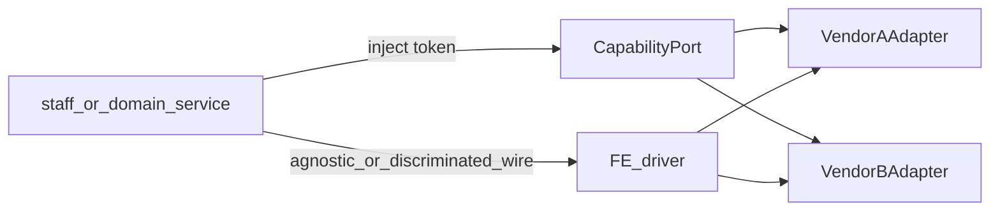

# External integrations pattern

**Status:** Locked for Nest paid / third-party capabilities.  
**Example (live):** media storage — Cloudinary + Cloudflare R2.  
**Example (live):** archive storage — Garage (staff proofs) — parallel capability, not a `MEDIA_PROVIDER` swap.  
**Media depth:** [`media-upload-strategy.md`](media-upload-strategy.md).  
**Archive depth:** [`archive-storage.md`](archive-storage.md).

---

## When this applies

Any **paid or heavy external vendor** the app talks to (media CDN/object storage, payment gateways, email/SMS, bot protection SDKs, …) where we may swap providers or must keep secrets and SDKs out of HTTP/domain layers.

**Not** for: Postgres/Prisma, session cookies, pure HTTP pulls of staff-configured URLs (iCal feeds), one-off deep links (Google Maps URL builder), or **HTTP request logs** (Nest stdout JSON → Loki/Grafana — [`request-logs.md`](request-logs.md); no vendor SDK in `integrations/`).

---

## Pattern

**Capability port → vendor adapters → env registry → provider-agnostic (or discriminated) wire → FE drivers.**

```text
apps/api/src/integrations/<capability>/
  <capability>.port.ts          # interface + InjectionToken
  <capability>.module.ts        # MEDIA_PROVIDER-style env → useClass
  adapters/
    <vendor-a>.adapter.ts
    <vendor-b>.adapter.ts

apps/api/src/staff/<feature>/   # HTTP façade; injects the port token
# or domain/<feature>/          # when shared with public/
```

| Layer | Owns |
|-------|------|
| Port | Capability methods + Nest `InjectionToken` |
| Adapter | One vendor SDK/HTTP client; reads that vendor’s env; maps to port/wire shapes |
| Module | Registers **one** adapter from env |
| Staff/domain service | Validation + orchestration; **never** imports vendor SDK |
| `@cabin/api-contract` | Wire types shared with FE (discriminated by `provider` when needed) |
| PMS/web client | Small upload/call drivers keyed by `intent.provider` / result shape |



---

## Rules

1. **One port per capability** (`MediaStoragePort`, later `PaymentGatewayPort`) — not one interface per vendor.
2. **Vendor imports only inside `adapters/`.** Controllers and domain services inject the token.
3. **Secrets only in root `.env`.** Never `VITE_*` vendor secrets.
4. **Prefer direct client → vendor** when bytes or redirects would burn VPS bandwidth (media upload-intent pattern). Nest mints credentials/URLs; FE executes.
5. **Wire types** stay in `@cabin/api-contract` when 2+ apps need them. Adapter **implementations** stay in `apps/api` (packages exclude fetch/SDK clients).
6. **Toggle with env** (e.g. `MEDIA_PROVIDER`). Default must keep current prod working.
7. **Missing vendor config → 503** (or clear unavailable), not silent fallback to another vendor.
8. **Do not** put Nest adapters in `packages/` “so FE can import them.”

---

## Adding a new capability (e.g. payment gateway)

1. Define port + token under `integrations/<capability>/`.
2. Implement first adapter; register via env (even if only one vendor today).
3. Add discriminated wire types to `@cabin/api-contract` if FE must branch.
4. Staff/public HTTP calls the domain/staff service that injects the port.
5. Document env in root `.env.example` + a short `_docs/` note if ops setup is non-trivial.
6. Follow [`.cursor/rules/api-integrations.mdc`](../.cursor/rules/api-integrations.mdc).

---

## Live example: media

| Piece | Location |
|-------|----------|
| Port | `apps/api/src/integrations/media/media-storage.port.ts` |
| Adapters | `…/adapters/cloudinary.adapter.ts`, `cloudflare-r2.adapter.ts` |
| Module | `MEDIA_PROVIDER` → active `useClass` |
| HTTP | `POST /staff/media/upload-intent` |
| FE | `apps/pms/src/lib/api/media.ts` |

## Live example: archive

| Piece | Location |
|-------|----------|
| Port | `apps/api/src/integrations/archive/archive-storage.port.ts` |
| Adapter | `…/adapters/garage.adapter.ts` |
| Module | `ARCHIVE_PROVIDER` → Garage `useClass` |
| HTTP | `GET/POST /staff/archive/*` |
| FE | `apps/pms/src/lib/api/archive.ts` |
