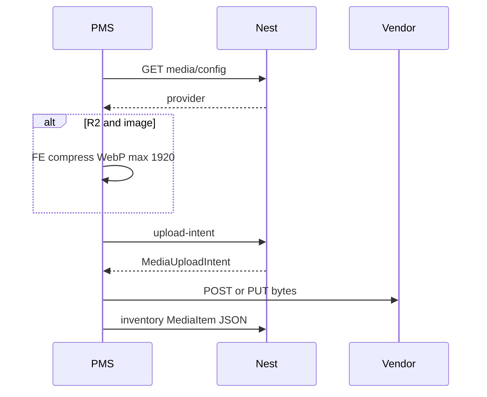

# Media upload strategy (PMS inventory)

**Status:** Phase 1 — multi-provider media storage behind a Nest port.  
**Dev default:** Cloudinary (server-side optimize).  
**Prod target:** Cloudflare R2 + custom domain; **FE** resize/compress images before upload.  
**Related:** `MediaItem` / `MediaUploadIntent` / `StaffMediaConfig` / `MediaProvider` in `@cabin/api-contract` · [`integrations-pattern.md`](integrations-pattern.md).  
**Product:** staff PMS only (ADMIN+ writes). Not public `web` guest uploads.

---

## Goal

- Store property `coverImage` and unit-type `media[]` as durable HTTPS URLs (`MediaItem`).
- Nest **never** receives or serves file bytes — only mints upload intents + accepts `MediaItem` JSON on create/update.
- Avoid VPS bandwidth for large images/videos (browser → provider).
- Swap vendors with env (`MEDIA_PROVIDER`) without changing inventory CRUD or form UI.

---

## Locked decisions

| Decision | Choice |
|----------|--------|
| Providers | **Cloudinary** (default / local) · **Cloudflare R2** + custom domain (prod) |
| Toggle | `MEDIA_PROVIDER=cloudinary \| cloudflare_r2` |
| Upload path | **Direct browser → provider** (Nest-signed / Nest-presigned) |
| Cloudinary optimize | Server-side: upload `c_limit,w_1920` + delivery `f_auto,q_auto,c_limit,w_1920` — **no FE resize** |
| R2 optimize | **FE only** via `browser-image-compression` (max edge 1920, quality 0.8, WebP) — **no** Cloudflare Image Transformations |
| Videos | Upload as-is on both providers; FE `<video>` plays the public URL |
| Secrets in Vite | **Never** |
| Who may upload | **ADMIN+** |
| Persist | Existing PATCH/POST with `MediaItem` |

### Rejected

| Approach | Why not |
|----------|---------|
| Nest file proxy | Burns VPS bandwidth |
| Cloudflare Image Resizing / `MEDIA_IMAGE_RESIZE_BASE` | Prefer FE compress for R2; avoid extra CF Images product |
| FE compress on Cloudinary path | Redundant with Cloudinary optimize |
| FE video encode | Out of Phase 1 |

---

## Architecture

```text
PMS (ADMIN+)
  │
  │  1. GET /staff/media/config  → { provider }
  │  2. If image + cloudflare_r2 → browser-image-compression
  │  3. POST /staff/media/upload-intent (final mime/size)
  │  4. Browser uploads (Cloudinary multipart | R2 PUT)
  │  5. Form MediaItem → inventory JSON save
```



Nest layout:

```text
apps/api/src/integrations/media/   ← port + adapters
apps/api/src/staff/media/          ← HTTP + mime/size validation
apps/pms/src/lib/media/            ← FE optimize (R2 images)
```

**R2 Content-Type:** compress **before** upload-intent — presign locks `Content-Type`.

---

## Size & type limits

Enforce in **UI + Nest** (`MEDIA_*` in `@cabin/api-contract`).

| Kind | Max size | Allowed MIME |
|------|----------|--------------|
| Image | **10 MB** | `image/jpeg`, `image/png`, `image/webp` |
| Video | **30 MB** | `video/mp4`, `video/webm` |

Gallery max **20**; cover = one image.

### FE R2 image knobs (`browser-image-compression`)

| Option | Value | Cloudinary parallel |
|--------|--------|---------------------|
| `maxWidthOrHeight` | `MEDIA_IMAGE_MAX_EDGE_PX` (1920) | `c_limit,w_1920` |
| `initialQuality` | `0.8` | `q_auto` stand-in |
| `fileType` | `image/webp` | `f_auto` stand-in |
| `useWebWorker` | `true` | — |
| `maxSizeMB` | `8` | under Nest 10 MB ceiling |

---

## Env (root `.env` only)

```text
# Local / default
MEDIA_PROVIDER=cloudinary
CLOUDINARY_CLOUD_NAME=
CLOUDINARY_API_KEY=
CLOUDINARY_API_SECRET=

# Prod (R2 + custom domain)
# MEDIA_PROVIDER=cloudflare_r2
# CLOUDFLARE_ACCOUNT_ID=
# CLOUDFLARE_R2_ACCESS_KEY_ID=
# CLOUDFLARE_R2_SECRET_ACCESS_KEY=
# CLOUDFLARE_R2_BUCKET=
# MEDIA_PUBLIC_BASE_URL=https://media.yourdomain.com
```

No `MEDIA_IMAGE_RESIZE_BASE`.

### R2 ops (prod)

1. Create bucket + Object Read & Write API token.
2. Connect **custom domain** → set `MEDIA_PUBLIC_BASE_URL`.
3. Bucket CORS: PMS origins + `PUT` + `Content-Type`.
4. Flip `MEDIA_PROVIDER=cloudflare_r2`.

---

## API

| Method | Path | Role | Notes |
|--------|------|------|--------|
| `GET` | `/staff/media/config` | ADMIN+ | `{ provider }` — FE decides compress before intent |
| `POST` | `/staff/media/upload-intent` | ADMIN+ | Final mime/size; provider-shaped intent |
| — | No Nest multipart | — | Do not proxy file bytes |

---

## PMS FE

| Concern | Behavior |
|---------|----------|
| Config | `getMediaConfig()` before optimize |
| Optimize | R2 + image only → `optimizeImageForUpload` |
| Upload | `uploadMediaFile` owns the full pipeline |
| Preview | HTTPS URLs only (no persisted `blob:`) |

---

## Quick reference for agents

- Vendor SDKs only under `apps/api/src/integrations/media/adapters/`.
- FE compress only when `provider === cloudflare_r2` and kind is image.
- Cloudinary: never FE-resize; keep delivery `f_auto,q_auto`.
- Never ship provider secrets to Vite.
