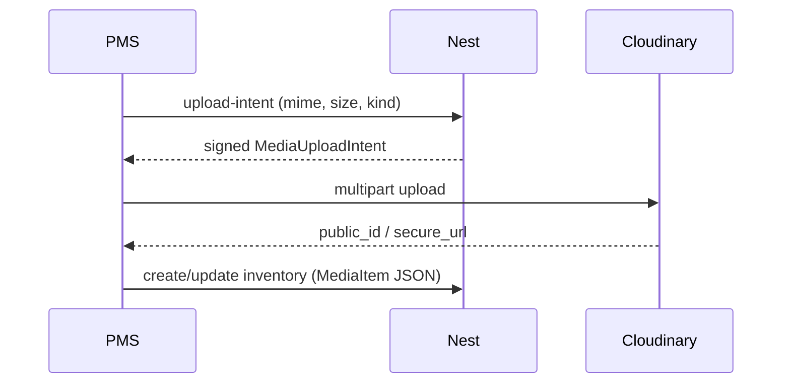

# Media upload strategy (PMS inventory)

**Status:** Phase 1 direction — **Cloudinary** (signed browser upload + CDN optimize).  
**Related:** inventory wire type `MediaItem` / `MediaUploadIntent` in `@cabin/api-contract`.  
**Product:** staff PMS only (ADMIN+ writes). Not public `web` guest uploads.

---

## Goal

- Store property `coverImage` and unit-type `media[]` as durable Cloudinary HTTPS URLs.
- Nest **never** receives or serves file bytes — only mints signed upload params + accepts `MediaItem` JSON on create/update.
- Avoid VPS bandwidth for large images/videos (delivery via Cloudinary CDN).
- Free Cloudinary plan is enough for Phase 1 staff volume (few properties, small galleries). Optimize with Cloudinary (`f_auto`, `q_auto`, width limit) — no FE compress library.

---

## Locked decisions

| Decision | Choice |
|----------|--------|
| Storage / CDN | **Cloudinary** |
| Upload path | **Direct browser → Cloudinary** (Nest-signed params) |
| Nest role | Mint upload-intent + validate limits; **not** a file proxy |
| Optimize | Cloudinary **`f_auto` + `q_auto` + `c_limit,w_1920`** (images) |
| FE compress lib | **None** (Phase 1) |
| Secrets in Vite | **Never** — no `VITE_*` Cloudinary secrets |
| Who may upload | Same as inventory writes: **ADMIN+** (session + `@StaffRoles('ADMIN')`) |
| Persist after upload | Existing PATCH/POST with `MediaItem` `{ id, kind, url, name, mimeType }` |

### Rejected (Phase 1)

| Approach | Why not |
|----------|---------|
| FE → Nest → storage (bridge) | Burns VPS bandwidth; Nest becomes a file pipe |
| Long-lived CDN keys in PMS bundle | Leak via DevTools / XSS / shared machines |
| Cloudflare R2 (now) | Account CC required; revisit later if free credits / scale hurt |
| MinIO on VPS | Media traffic uses VPS bandwidth |
| FE `browser-image-compression` / ffmpeg | Redundant with Cloudinary optimize; video encode too heavy |

R2 / MinIO remain later options if Cloudinary free credits are exhausted at Phase 2 public traffic.

---

## Architecture

```text
PMS (ADMIN+)
  │
  │  1. POST /staff/media/upload-intent
  │     body: { kind, mimeType, byteSize, name? }
  │     ← MediaUploadIntent (cloudName, apiKey, timestamp, signature, folder, publicId, …)
  │
  │  2. multipart POST → api.cloudinary.com/.../upload   ← not via Nest
  │
  │  3. Form state MediaItem { id, kind, url: f_auto,q_auto delivery URL, name, mimeType }
  │
  └─ 4. POST/PATCH /staff/properties|unit-types   ← JSON only (existing)
```



**Bandwidth:** image/video bytes never traverse the Nest VPS. Nest only sees small JSON.

---

## Size & type limits

Enforce in **UI + Nest upload-intent** (same numbers from `@cabin/api-contract`).

| Kind | Max size (picker / intent) | Allowed MIME |
|------|----------------------------|--------------|
| Image | **10 MB** | `image/jpeg`, `image/png`, `image/webp` |
| Video | **30 MB** | `video/mp4`, `video/webm` |

Also:

- Gallery cap: **max 20** items per unit-type `media[]`.
- Cover: **one** image only.
- Images: upload may include `c_limit,w_1920`; delivery URL uses **`f_auto,q_auto,c_limit,w_1920`**.
- Video: **no** FE or Nest transcode — reject oversized / wrong type.
- Constants: `MEDIA_*` in `@cabin/api-contract`.

---

## Env (Nest / root `.env` only — never Vite)

```text
CLOUDINARY_CLOUD_NAME=
CLOUDINARY_API_KEY=
CLOUDINARY_API_SECRET=
```

From [Cloudinary API Keys](https://console.cloudinary.com/app/settings/api-keys).

---

## API

| Method | Path | Role | Notes |
|--------|------|------|--------|
| `POST` | `/staff/media/upload-intent` | ADMIN+ | Validates mime + size; returns signed Cloudinary upload params |
| — | No Nest multipart | — | Do not add a Nest file body endpoint for Phase 1 |

Response: `MediaUploadIntent` (`id`, `cloudName`, `apiKey`, `timestamp`, `signature`, `folder`, `publicId`, `resourceType`, optional `transformation`).

**Delete / orphan cleanup:** out of Phase 1 MVP. Orphans if user uploads then cancels the form are acceptable until a later GC job.

---

## PMS FE

| Concern | Behavior |
|---------|----------|
| Pick file | Mime/size check → upload-intent → Cloudinary multipart → `MediaItem` with optimized URL |
| Preview | CDN `https://` URLs (no persisted `blob:`) |
| Submit gate | Disable Save while uploading; reject any leftover `blob:` URLs |
| Helper | `src/lib/api/media.ts` |

---

## Security checklist

- [x] Cloudinary secret only in Nest / root `.env`
- [x] Upload-intent requires staff session + ADMIN+
- [x] Intent checks mime + declared size before signing
- [x] Public delivery URLs are read-only CDN links — not the API secret
- [ ] Avoid logging signed upload payloads in analytics

---

## Out of scope (Phase 1)

- Nest multipart upload proxy
- FE video / image re-encode libraries
- Automatic orphan deletion from Cloudinary
- Public `web` guest uploads
- R2 / MinIO migration

---

## Quick reference for agents

- Contract assumes **CDN URL in `MediaItem.url`** — do not change Nest inventory CRUD to accept files.
- Prefer **Cloudinary + signed direct upload + `f_auto`/`q_auto`**.
- Enforce **10 MB image / 30 MB video** (+ mime allowlist) on FE and Nest.
- Never ship `CLOUDINARY_API_SECRET` to Vite.
